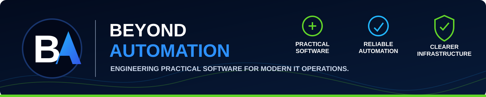

 

[**Website**](https://beyondautomation.io) · [**Download AIHAT**](https://beyondautomation.io/aihat) · [**LinkedIn**](https://www.linkedin.com/company/beyond-automation-io)

## What We Build

Beyond Automation engineers practical tools for the people responsible for keeping modern IT environments healthy, secure, patched, and connected.

We focus on real operational problems and build software that reduces uncertainty, surfaces risk clearly, and helps IT professionals make better decisions.

| Product | Purpose | Status |
| --- | --- | --- |
| [**AIHAT**](https://github.com/Beyond-Automation/AIHAT-Releases) | Windows infrastructure health assessment and reporting | **v1.2.0 · Released Free** |
| **PatchPilot** | Windows patch readiness and update-health assessment | **Release Candidate** |
| **NetFixLab** | Practical network troubleshooting and diagnostics | **Launching** |

### AIHAT — Infrastructure Health Audit Toolkit

AIHAT evaluates Windows system health, Windows Update, security, and networking while producing clear findings and professional local reporting.

**[Download the signed AIHAT v1.2.0 installer](https://github.com/Beyond-Automation/AIHAT-Releases/releases/tag/v1.2.0)**

- Free public Windows tool
- Digitally signed and timestamped
- Windows verified publisher: **Randall Lewis**
- Read-only assessment
- No account, telemetry, or audit-result upload
- Published SHA-256 checksum

### PatchPilot — Windows Patch Readiness & Update Health

Designed to expose update blockers and help IT teams understand why Windows endpoints are not patching correctly.

### NetFixLab — Network Troubleshooting & Diagnostics

Focused on helping IT professionals diagnose connectivity, DNS, routing, and infrastructure problems faster.

---

## Engineering Standard

Our products are built around disciplined engineering rather than disposable scripts:

- Security-conscious design and least-privilege access
- Version-controlled development and pull-request workflows
- Protected branches and automated quality gates
- Dependency, secret, and vulnerability scanning
- Professional customer-facing packaging
- Real-world user acceptance testing
- Signed, checksummed public releases
- Maintainable architecture and documented support boundaries

We share product outcomes, engineering lessons, demonstrations, and technical evidence while protecting proprietary source code and implementation details.

### Public proof. Private engineering core.

---

## Trust and Security

Official public releases are distributed only through repositories owned by the **Beyond-Automation** organization and through [beyondautomation.io](https://beyondautomation.io).

- [AIHAT releases and documentation](https://github.com/Beyond-Automation/AIHAT-Releases)
- [Organization security policy](https://github.com/Beyond-Automation/.github/blob/main/SECURITY.md)
- [Beyond Automation contact](mailto:contact@beyondautomation.io)

Do not download Beyond Automation software from third-party mirrors. Security vulnerabilities should never be posted in public issues.

---

## Focus Areas

`Windows Infrastructure` · `PowerShell Automation` · `Infrastructure Health` · `Patch Readiness` · `Network Troubleshooting` · `Release Engineering` · `IT Operations`

---

**Beyond Automation**  
[Website](https://beyondautomation.io) · [AIHAT](https://beyondautomation.io/aihat) · [LinkedIn](https://www.linkedin.com/company/beyond-automation-io)

© 2026 Beyond Automation. All rights reserved.

